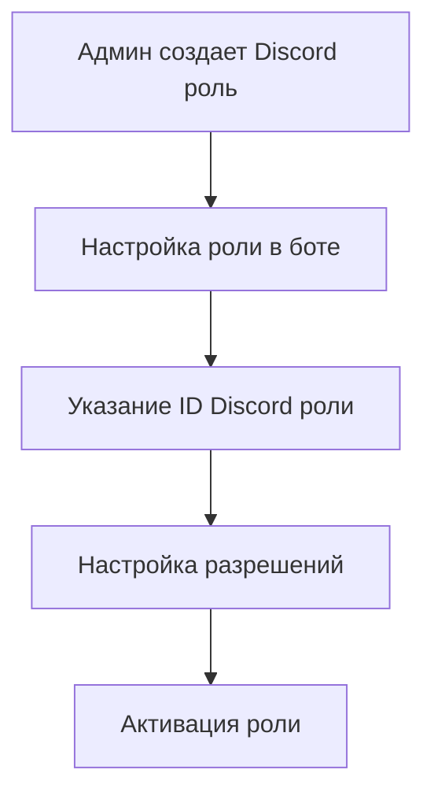
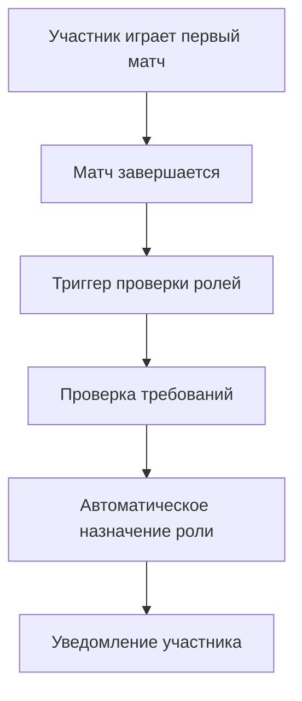
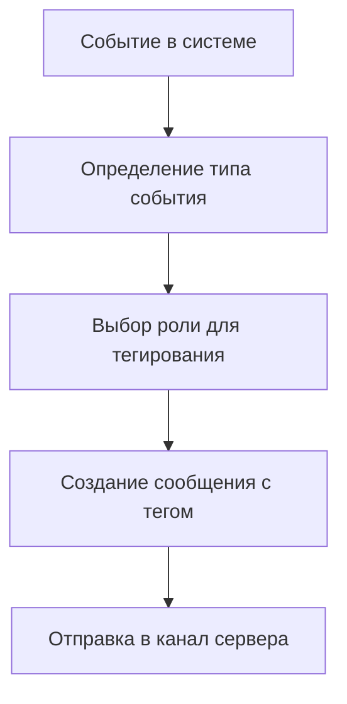

# 🔧 Система управления ролями Discord Rating Bot

## 📋 Обзор

Система управления ролями предоставляет автоматическое назначение ролей игрокам и судьям, а также интеллектуальное тегирование ролей для различных событий в системе.

## 🎯 Основные возможности

### ✅ **Автоматическое назначение ролей**
- **Игроки** - автоматически назначаются после первой игры
- **Судьи** - назначаются администраторами вручную
- **Администраторы** - назначаются автоматически при наличии Discord прав
- **Организаторы турниров** - назначаются администраторами

### 🔔 **Умное тегирование ролей**
- **Судьи** - тегируются при необходимости модерации матчей
- **Игроки** - тегируются при начале/завершении сезонов и турниров
- **Администраторы** - тегируются при критических событиях безопасности

### 🛡️ **Система разрешений**
- Детальные разрешения для каждой роли
- Проверка прав доступа к командам
- Аудит назначения и удаления ролей

## 🚀 Быстрый старт

### 1. **Автоматическая настройка**
При добавлении бота на сервер автоматически создаются:
- Роли по умолчанию в базе данных
- Конфигурация разрешений
- Система автоматического назначения

### 2. **Настройка Discord ролей**
```bash
# Создайте роли на сервере Discord:
🎮 Игроки - для участников рейтинговой системы
⚖️ Судьи - для модерации матчей
👑 Администраторы - для управления системой
🏆 Организаторы турниров - для создания турниров
```

### 3. **Настройка ролей в боте**
```bash
/setup_default_roles - Настройка ролей по умолчанию
/create_role - Создание конкретной роли
/assign_role - Назначение роли участнику
/list_roles - Просмотр всех ролей
```

## 📚 Команды управления ролями

### **Настройка ролей**
```bash
/setup_default_roles
```
**Описание**: Настраивает роли по умолчанию для сервера
**Требования**: Права администратора
**Результат**: Создает конфигурацию ролей в базе данных

### **Создание роли**
```bash
/create_role role_type:players discord_role_id:123456789 role_name:"Игроки" auto_assign:true
```
**Параметры**:
- `role_type` - Тип роли (players, referees, admins, tournament_organizers)
- `discord_role_id` - ID Discord роли
- `role_name` - Название роли
- `auto_assign` - Автоматическое назначение

### **Назначение роли**
```bash
/assign_role role_type:referees member:@username
```
**Описание**: Назначает роль участнику
**Требования**: Права администратора

### **Удаление роли**
```bash
/remove_role role_type:referees member:@username
```
**Описание**: Убирает роль у участника
**Требования**: Права администратора

### **Просмотр ролей**
```bash
/list_roles
```
**Описание**: Показывает все настроенные роли сервера

### **Тест тегирования**
```bash
/test_role_tagging event_type:referee_needed
```
**Описание**: Тестирует тегирование ролей для различных событий

## 🎮 Типы ролей

### **🎮 Игроки (Players)**
- **Автоназначение**: ✅ Да (после первой игры)
- **Разрешения**:
  - Создание вызовов на дуэли
  - Участие в турнирах
  - Просмотр статистики
  - Просмотр таблицы лидеров

### **⚖️ Судьи (Referees)**
- **Автоназначение**: ❌ Нет (только вручную)
- **Разрешения**:
  - Модерация матчей
  - Разрешение споров
  - Объявление результатов
  - Доступ к админ панели

### **👑 Администраторы (Admins)**
- **Автоназначение**: ✅ Да (при Discord правах)
- **Разрешения**:
  - Управление сезонами
  - Управление турнирами
  - Управление ролями
  - Просмотр логов безопасности

### **🏆 Организаторы турниров (Tournament Organizers)**
- **Автоназначение**: ❌ Нет (только вручную)
- **Разрешения**:
  - Создание турниров
  - Управление турнирами
  - Объявление результатов

## 🔔 Система тегирования ролей

### **Автоматическое тегирование по событиям**

#### **Судьи тегируются при:**
- 🚨 **referee_needed** - Необходимость модерации матча
- ⚖️ **dispute_resolution** - Разрешение спора между игроками
- 🎮 **match_moderation** - Нарушение правил в матче

#### **Игроки тегируются при:**
- 📅 **season_start** - Начало нового сезона
- 🏁 **season_end** - Завершение сезона
- 🏅 **tournament_start** - Начало турнира
- 🏆 **tournament_end** - Завершение турнира

#### **Администраторы тегируются при:**
- 🚨 **admin_notification** - Важные системные уведомления
- 🔒 **security_alert** - Критические события безопасности

### **Примеры тегирования**

```python
# Тегирование судей для модерации
tagged_message = await role_manager.tag_role_for_event(
    guild_id=123456789,
    event_type="referee_needed",
    message="🚨 Требуется модерация матча #123"
)
# Результат: "<@&987654321> 🚨 Требуется модерация матча #123"

# Тегирование игроков о начале сезона
tagged_message = await role_manager.tag_role_for_event(
    guild_id=123456789,
    event_type="season_start",
    message="🎉 Новый сезон начался!"
)
# Результат: "<@&111222333> 🎉 Новый сезон начался!"
```

## 🗄️ Структура базы данных

### **Основные таблицы**

#### **guilds**
- Конфигурация серверов Discord
- Настройки языка, часового пояса, префикса

#### **guild_roles**
- Конфигурация ролей для каждого сервера
- Связь с Discord ролями
- Настройки автоназначения

#### **guild_role_permissions**
- Разрешения для каждого типа роли
- Описания разрешений
- Возможность отключения разрешений

#### **guild_member_roles**
- Назначенные роли участникам
- История назначений
- Временные роли с истечением

### **Представления (Views)**

#### **active_guild_roles**
- Активные роли всех серверов
- Информация о ролях и разрешениях

#### **guild_member_roles_view**
- Роли всех участников
- История назначений и статус

### **Функции базы данных**

#### **get_member_permissions(guild_id, member_id)**
- Получение всех разрешений участника
- Учитывает все назначенные роли

#### **member_has_permission(guild_id, member_id, permission)**
- Проверка наличия конкретного разрешения
- Возвращает TRUE/FALSE

#### **auto_assign_player_role(guild_id, member_id)**
- Автоматическое назначение роли игрока
- Срабатывает при завершении матча

## ⚙️ Настройка и конфигурация

### **Переменные окружения**
```bash
# Интервал проверки ролей (в секундах)
ROLE_CHECK_INTERVAL=300

# Автоматическое назначение ролей
AUTO_ASSIGN_ROLES=true

# Уведомления о назначении ролей
ROLE_NOTIFICATIONS=true
```

### **Конфигурация ролей**
```python
# Настройка роли игрока
player_role = {
    "type": "players",
    "auto_assign": True,
    "permissions": [
        "can_challenge",
        "can_join_tournaments",
        "can_view_stats",
        "can_view_leaderboard"
    ]
}

# Настройка роли судьи
referee_role = {
    "type": "referees",
    "auto_assign": False,
    "permissions": [
        "can_moderate_matches",
        "can_resolve_disputes",
        "can_announce_results"
    ]
}
```

## 🔄 Жизненный цикл ролей

### **1. Создание роли**


### **2. Автоназначение роли игрока**


### **3. Тегирование ролей**


## 🧪 Тестирование системы ролей

### **Тест автоназначения**
```bash
# 1. Создайте тестового участника
# 2. Сыграйте тестовый матч
# 3. Проверьте автоматическое назначение роли
```

### **Тест тегирования**
```bash
# 1. Настройте роли для сервера
# 2. Используйте /test_role_tagging
# 3. Проверьте правильность тегирования
```

### **Тест разрешений**
```bash
# 1. Назначьте роли участникам
# 2. Проверьте доступ к командам
# 3. Убедитесь в корректности ограничений
```

## 🚨 Устранение неполадок

### **Роль не назначается автоматически**
- ✅ Проверьте настройку `auto_assign = true`
- ✅ Убедитесь, что участник сыграл хотя бы один матч
- ✅ Проверьте права бота на назначение ролей

### **Тегирование не работает**
- ✅ Проверьте настройку ролей в базе данных
- ✅ Убедитесь, что указан правильный ID Discord роли
- ✅ Проверьте права бота на отправку сообщений

### **Ошибки базы данных**
- ✅ Запустите миграцию `006_guild_roles.sql`
- ✅ Проверьте подключение к базе данных
- ✅ Убедитесь в корректности схемы

## 📈 Производительность

### **Оптимизация запросов**
- Индексы на часто используемых полях
- Представления для сложных запросов
- Кэширование конфигурации ролей

### **Масштабирование**
- Поддержка множественных серверов
- Асинхронная обработка назначений
- Фоновая проверка ролей

## 🔐 Безопасность

### **Проверка прав**
- Валидация Discord ролей
- Проверка прав бота
- Аудит всех операций с ролями

### **Защита от злоупотреблений**
- Ограничение на количество ролей
- Проверка валидности разрешений
- Логирование всех изменений

## 📚 Дополнительные ресурсы

### **Связанные файлы**
- `models/guild_roles.py` - Модели ролей
- `services/role_manager.py` - Сервис управления ролями
- `cogs/role_management.py` - Discord команды
- `database/006_guild_roles.sql` - Миграция базы данных

### **Команды для разработчиков**
```bash
# Запуск миграции
psql -d your_database -f database/006_guild_roles.sql

# Тестирование ролей
python -m pytest tests/unit/test_roles.py -v

# Проверка базы данных
psql -d your_database -c "SELECT * FROM active_guild_roles;"
```

---

## 🎉 Готово к использованию!

Система управления ролями полностью интегрирована с Discord Rating Bot и готова к использованию. Автоматическое назначение ролей, умное тегирование и детальная система разрешений обеспечат эффективное управление вашим сервером.

**Удачного использования! 🚀✨**